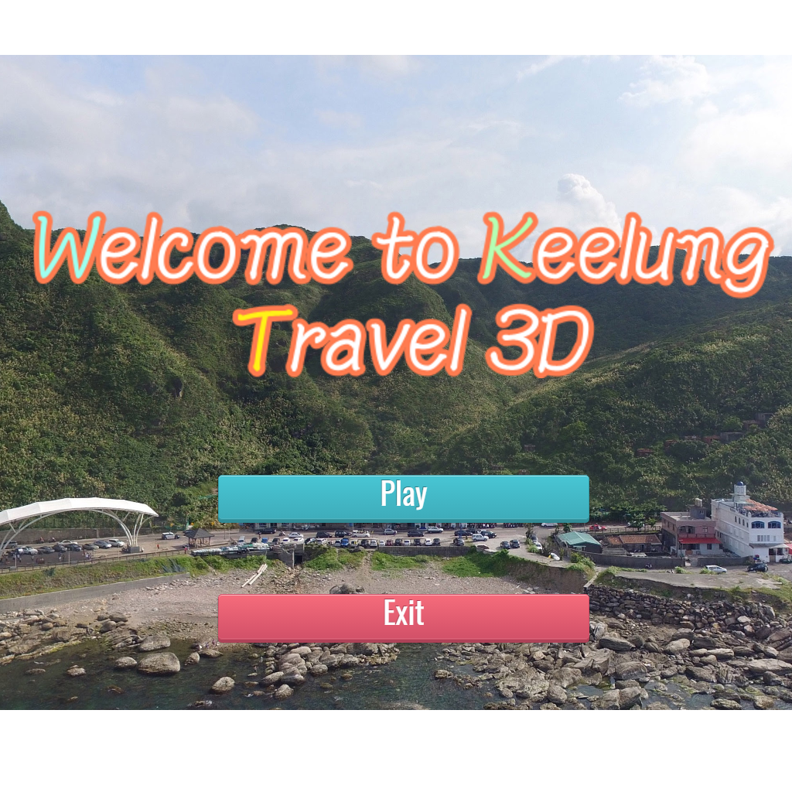
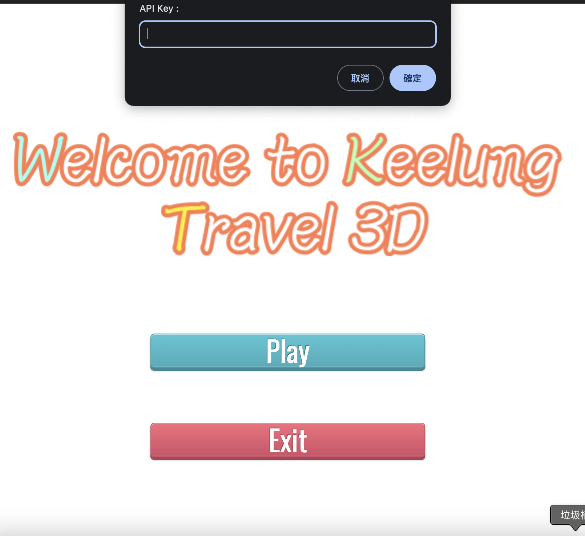

# KeeTravel3D
旅遊結合猜謎問答，結合Google Map API。讓使用者透過此網站，能夠透過3D實境，達到不用出門就能逛遍基隆多個觀光景點，透過地點謎題的設置，讓使用者能夠對基隆的旅遊路線規劃更詳細周全。
# [Try it](https://kstmasa.github.io/KeeTravel3D/)
KeeTravel3D : [Link](https://kstmasa.github.io/KeeTravel3D/)  

# API Key
自從街景服務(Google Street View)開始計費後，此專案的Key改為自行輸入  
[參考連結](https://developers.google.com/maps/documentation/javascript/usage-and-billing?hl=zh-tw#pricing-for-product)

